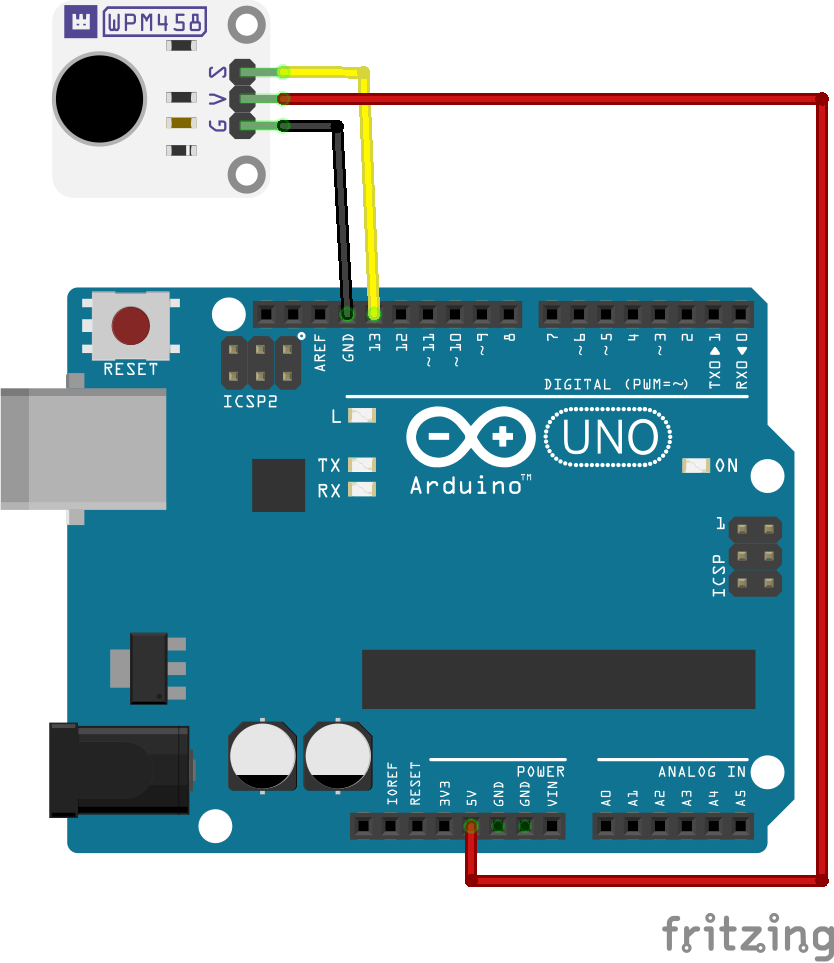

# WPSM458 vibration motor module

This example shows how you can use the Whadda WPSE352 vibration motor module with an Arduino® compatible board.
The example program produces the classic "Nokia SMS vibration" pattern on the vibration motor.

## Library dependencies
* None

## Wiring diagram

## Additional information
  For more information about the Whadda WPM458 vibration motor module, check the manual available at [whadda.com](https://whadda.com)
